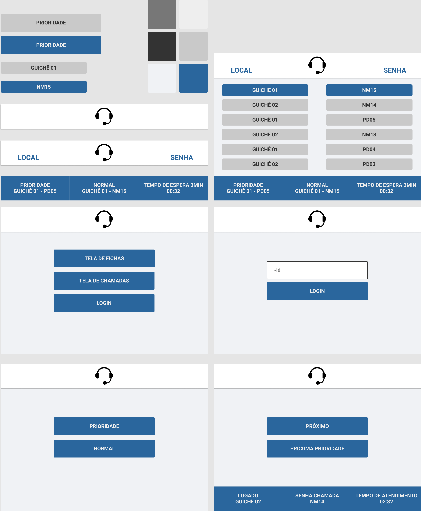

[](https://twitter.com/t_h_e_u) 
[](https://www.linkedin.com/in/matheusgbatista/) 
[](https://t-heu.github.io) 

# 📷 Prototype
<p align="center">
  
</p>

# ⚡ Tech Stack
- [Express](https://expressjs.com/)
- [Ejs (template engine)](https://ejs.co/)
- [Firebase](https://firebase.google.com)

# ⚙️ How to run
- set your firebase settings, and also set your settings in `.env`
```shell
yarn
yarn dev or yarn start
```
